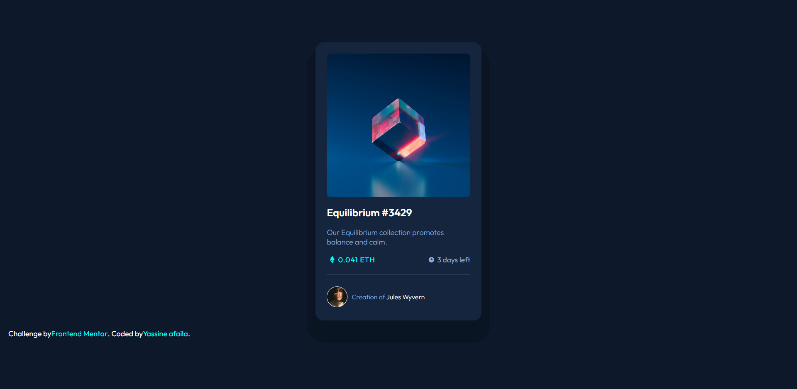

# Frontend Mentor - NFT preview card component solution

This is a solution to the [NFT preview card component challenge on Frontend Mentor](https://www.frontendmentor.io/challenges/nft-preview-card-component-SbdUL_w0U). Frontend Mentor challenges help you improve your coding skills by building realistic projects. 

### The challenge

Users should be able to:

- View the optimal layout depending on their device's screen size
- See hover states for interactive elements

### Screenshot

### Links

- Solution URL: [Add solution URL here](https://your-solution-url.com)
- Live Site URL: [Add live site URL here](https://your-live-site-url.com)

## My process

### Built with

- Semantic HTML5 markup
- CSS custom properties
- Flexbox

### What I learned

=> i learn in this project how to a overlay image also i learn how to add an icon svg with using the src in html but just using the psuedo elements in css(::before)

To see how you can add code snippets, see below:

### Useful resources

- [overlay](https://www.youtube.com/watch?v=Himo9n0BaDw&ab_channel=ProWeb) - This is an amazing video which helped me finally understand the overlay effect. I'd recommend it to anyone still learning this concept.

## Author
- Frontend Mentor - [@@Yassineafaila](https://www.frontendmentor.io/profile/Yassineafaila)
- Twitter - [@AfailaYassine](https://www.twitter.com/AfailaYassine)

